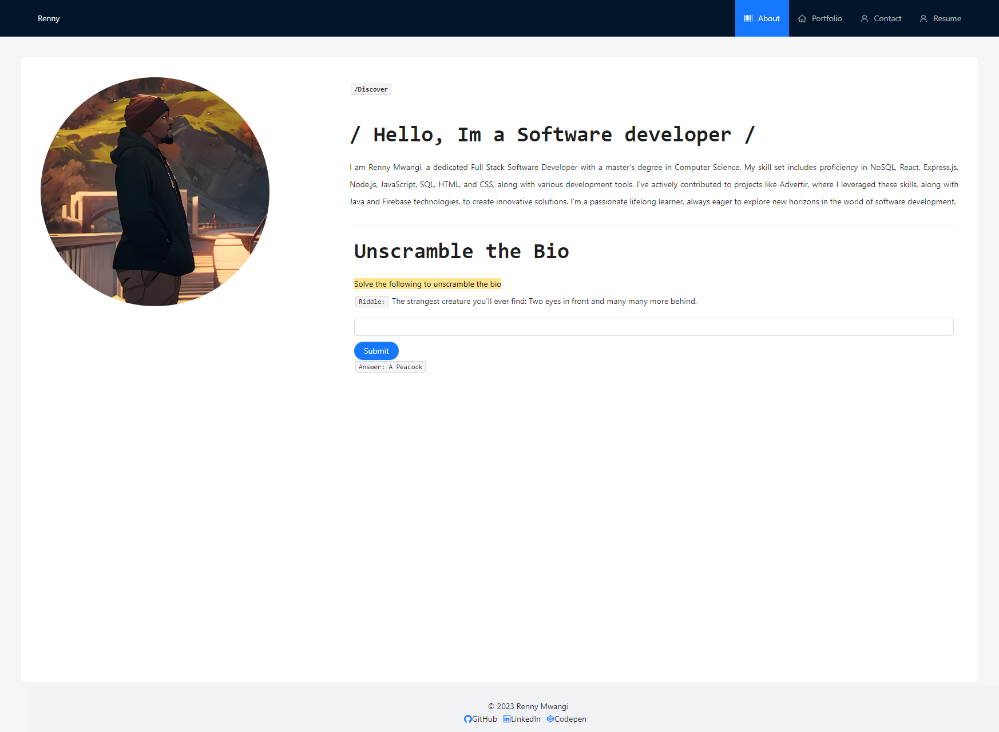
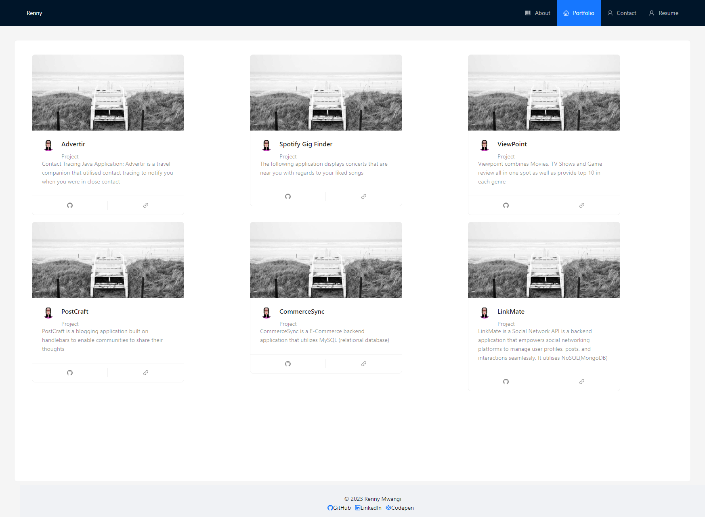
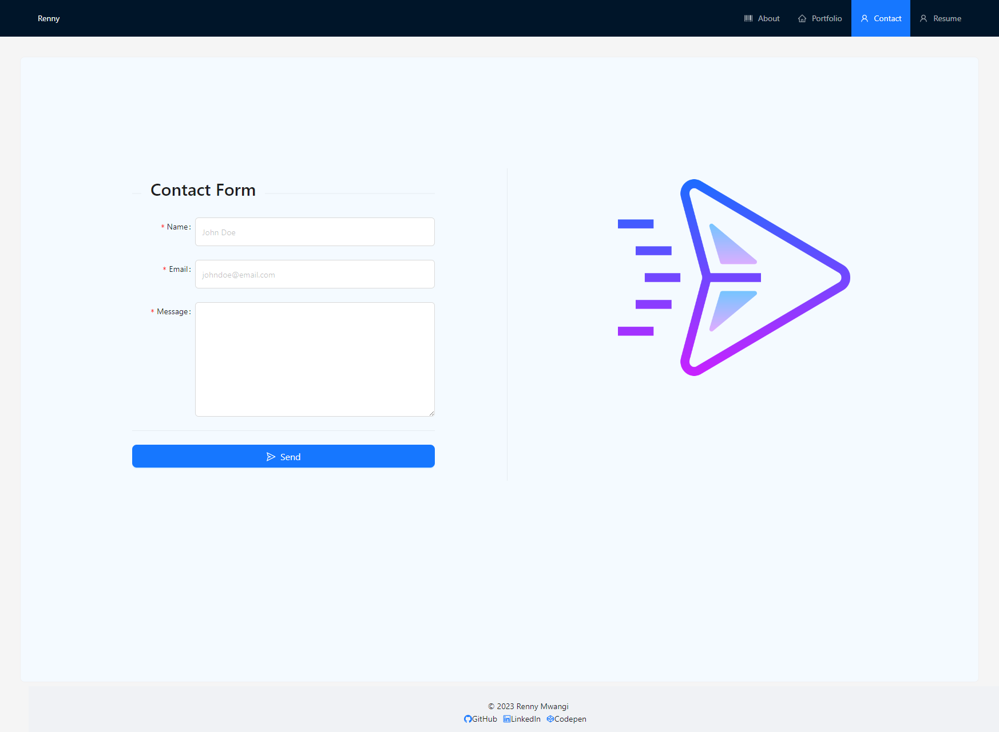
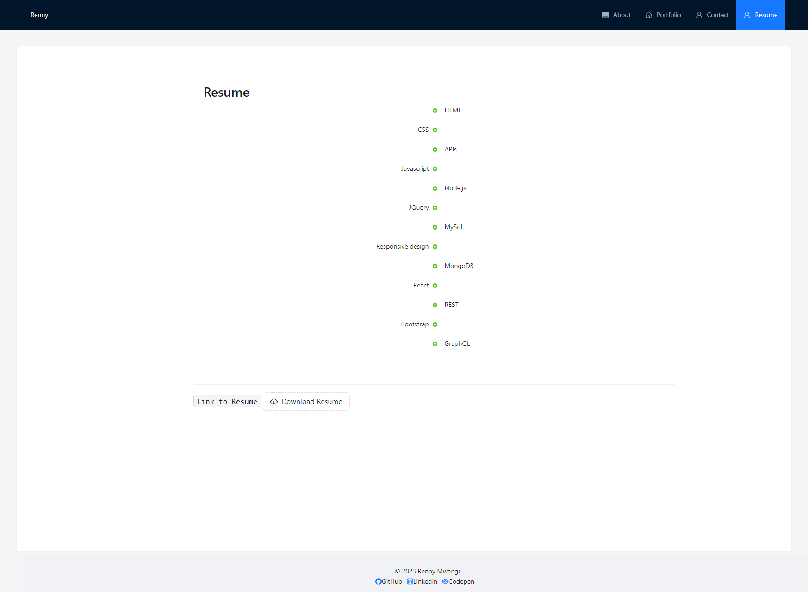

# Portfolio

[](https://opensource.org/licenses/MIT) [](code_of_conduct.md)

## Table of Contents

- [Description](#description)

- [Live-URL](#live-url)

- [Screenshots](#screenshots)

- [Technologies-Used](#technologies-used)

- [Installation](#installation)

- [Features](#features)

- [Usage-Information](#usage-information)

- [Suggested-Future-Development](#suggested-future-development)

- [Contribution-Guidelines](#contribution-guidelines)

- [Test-Instructions](#test-instructions)

- [License](#license)

- [Questions](#questions)

## Description

This portfolio application was developed and designed to showcase my web applications, resume, and skills to potential employers, clients, and interested parties. It was created using React an open sourced JavaScript library for building user interfaces, and Material-UI, a popular component library that implements Google's Material Design. React was created by Facebook developers and helps simplify the process of building interactive and dynamic user interfaces by providing a component-based structure, efficient rendering through the virtual DOM, and a declarative syntax. It operates via a one page application, but gives the user experience of multiple page functionality.

## Live URL

[Link to Renny's Portfolio](https://graceful-pothos-74b54f.netlify.app/)

## Screenshots









## Technologies Used

This application is powered by React.js (v18.2.0). Material UI (v5.13.6) and CSS were utilized to create the overall styling of the user interface.


## Installation

- To make changes to the code base, clone the repo [Clone Repo](https://github.com/MwangiR/Code_Chronicles.git), run npm i within the root directory, then run npm start -> you will then be taken to a live server running the site where if edits are made to the code base they can be seen in real time.

- Users can also feel free to access the live application directly by visiting the Netlify link [Live Portfolio](https://graceful-pothos-74b54f.netlify.app/).

### Prerequisites

- Node.js and npm should be installed on your system. You can download and install them from [Node.js website](https://nodejs.org/).

### Installation Steps

1. Clone the Repository:

   Open your terminal and navigate to the directory where you want to create the project. Then run the following command to clone the repository:

   ```bash
   git clone <repository-url>
   ```

2. Navigate to the Project Directory:
   Change your current working directory to the project folder:

   ```bash
   cd react-portfolio
   ```

3. Install Dependencies:
   Run the following command to install project dependencies specified in the package.json file:
   ```bash
   npm install
   ```
4. Run the Application:
   Run the following command to start the application:

   ```bash
   npm run dev
   ```

   This will build the React application and open it in your default web browser. You can access the application at http://localhost:3001/.

   You should now see your portfolio website running locally. You can customize the content and styles by modifying the components, images, and CSS files in the provided project structure.

   Project Structure
   The React components for your portfolio are located in the src/components directory.
   The individual pages for your portfolio are in the src/pages directory.
   Images used in your portfolio are in the src/images directory.
   The main entry point for your React application is src/App.jsx.
   You can customize styles in the src/App.css file.
   The project configuration is managed in vite.config.js.

Make sure to adapt the content and configuration as needed for your specific portfolio.

## Features

Features of the site include Reacts ability to easily create a one page application that appears as though it is many pages. Users can easily navigate the site and view corresponding project code and websites from the portfolio page, download my most up to date resume as a PDF, and leave a mock message where error and authentication are required. Adding the backend framework and submit functionality are still a work in progress.

## Usage Information

This application is very user intuitive, just visit the site (https://graceful-pothos-74b54f.netlify.app/), navigate through different pages using the links in the nav-bar, and view desired content.

## Suggested Future Development

- Dark Mode Toggle
- Continued display and UI development
- Hamburger menu implemented on the navbar
- Add backend and middleware so users can contact me (Express/MySQL, or GraphQL/MongoDB)
- Including unit testing

## Contribution Guidelines

Open to collaboration, if you choose to do so open an issue and modify any changes you would like to see on a feature branch and wait for approval before merging to the main branch.

NOTICE: Contributor Covenant is released under the Creative Commons Attribution 4.0 International Public License, which requires that attribution be included.

## Test Instructions

There is currently no unit testing written yet for this application.

## License

NOTICE: This application is covered under the MIT License

## Questions

Have additional questions? Click the links below to reach me through my GitHub account or Email address.

[Link to Github](https://github.com/MwangiR)
